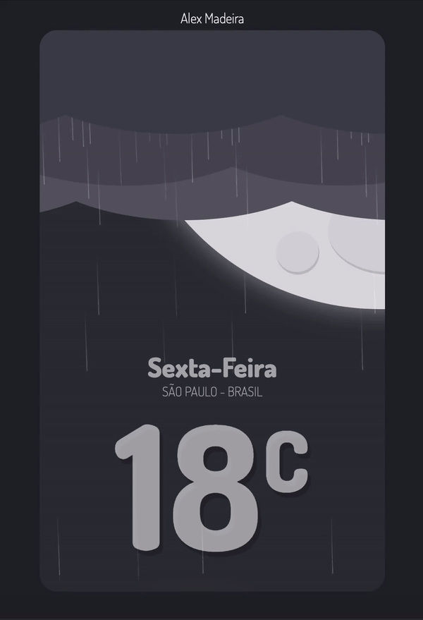

# CSS3 - Sexta-feira Chuvosa

Um projeto que desenvolvi para passar o tempo e me divertir.

## Preview

## Começando

Utilizei apenas HTML (básico), e CSS3, não é necessário nenhum pré-requisito para rodar a aplicação apenas um navegador :)

### Deploy

Não há rotina de deploy, utilizo a ferramenta [netlify]("https://www.netlify.com/")

## Autor

- **Alex Madeira** - [Bitbucket](https://bitbucket.org/alexmadeira5/)

## Licença

Esse projeto não tem Licença mas sinta-se a vontade para olhar baixar copiar não tem problema :)
